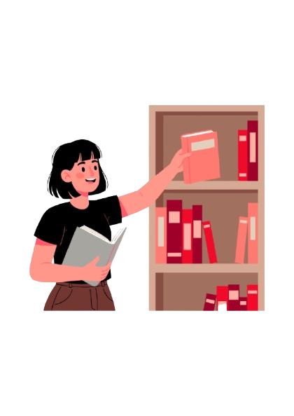
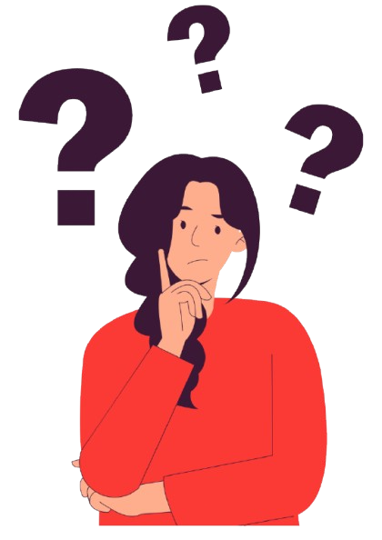
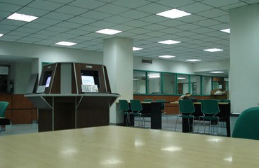

# andreiii-ui.github.io
<!DOCTYPE html>
<!-- HTML document declaration with English-US language and no-js class for JavaScript fallback -->
<html lang ="en-US">
<head>
    <!-- Page title displayed in browser tab -->
    <title>University of the East - Department of Library</title>
    
    <!-- Favicon - UE Red Seal icon -->
    <link rel="icon" href="UE_RED_SEAL_09.png">
    
    <!-- External CSS stylesheet for styling -->
    <link rel="stylesheet" href="UE-lib.css">
</head>

<!-- Main body section with unique ID for styling -->
<body id="body">
    
    <!-- Header container wrapper -->
    

        
        <!-- Navigation bar with fixed position at top -->
        <nav id="navbar">
            
            <!-- Header section inside navbar -->
            <header id="header-lib">
                
                <!-- Logo link - clicking opens UE website in new tab -->
                <a id="header-logo-link" href="https://www.ue.edu.ph/mla/" target="_blank">
                    
                    <!-- UE Logo image -->
                    
                </a>
                
                <!-- Welcome text heading -->
                <h2 id="header-text">University of the East</h2>
                <h4 id="header-text2">Department of Libraries</h4>
                <h5 id="header-text3">Manila</h5>
                

                    <a id="btn-services" class="nav-button" href="https://www.ue.edu.ph/mla/flexible-ue-library-services/">UE Library Services</a>
                    <a id="btn-announcement" class="nav-button" href="https://www.ue.edu.ph/mla/about-the-ue-library/#">Announcement</a>
                    <a id="btn-regulations" class="nav-button" href="https://www.ue.edu.ph/mla/rules-and-regulation/">Rules and Regulations</a>
                

            </header>
        </nav>    
    

<!-- Toggle Button for Side Panel -->
<button id="toggle-sidebtn" class="toggle-sidebtn">☰ Menu</button>

    

        <h4 class="section-title">Library Services</h4>
        <a id="btn-brnch" class="libraries" href="https://www.ue.edu.ph/mla/branches-library/">Library Branches</a>
        <a id="btn-per" class="libraries" href="https://www.ue.edu.ph/mla/periodicals-and-filipiniana/">Periodicals and Filipiniana</a>
        <a id="btn-ref" class="libraries" href="https://www.ue.edu.ph/mla/reference/">Reference and Library Science</a>
        <a id="btn-circ" class="libraries" href="https://www.ue.edu.ph/mla/circulation/">Circulation and Reserve</a>
        <a id="btn-libsys" class="libraries" href="https://www.ue.edu.ph/mla/services-and-facilities-2/">Library System</a>
    

    

        <h4 class="section-title">Online Services</h4>
        <a id="btn-opac" class="olsrv" href="https://search.follettsoftware.com/metasearch/rest/v2/users/sso/authenticate">Web OPAC</a>
        <a id="btn-sbsc" class="olsrv" href="https://www.ue.edu.ph/mla/online-subscription-2/">Online Subscription</a>
        <a id="btn-dtbs" class="olsrv" href="https://www.ue.edu.ph/mla/free-online-databases-2/">Free Online Databases</a>
        <a id="btn-odtbs" class="olsrv" href="https://www.ue.edu.ph/mla/open-source-databases-2/">Open Source Databases</a>
        <a id="btn-tdtbs" class="olsrv" href="https://www.ue.edu.ph/mla/?page_id=12907">Trial Databases</a>
    

    
    

        <b>
            <h4 id="aboutus">About Us</h4>
            The Department of Libraries acquires and catalogs books, non-books, CS-ROMs and audio visual materials, supplementing these with an extensive e-journals collection, to support UE's instructional and research programs. The Department's extensive catalog is for the use of students, faculty members and other members of the UE community. The Department, which is headed by its Director, is composed of the Main Library and the respective libraries of the different Colleges. Under the Department's supervision is the Audiovisual Office.
            The Audio-visual Office makes available to the community equipment such as film, and overhead projectors: DVD, VCD, and other video players; tape recorders and sound systems; and the contents of the media library consisting of sound and video tapes, audio cassettes, graphs posters, transparencies, filmstrips, slides and others.
        </b>
    

    

        <b> 
            <h4 id="mso1">Mission Statement and Objectives</h4>
            The primary mission of the University Library is to support the teaching, research, learning, extension service, and cultural endeavors of the University community. It is committed to provide accessible, cost-effective, and innovative information services and programs.
            The general objective is to provide adequate, timely, and relevant information resources and innovative services that support the full spectrum of teaching, learning and research needs of the University community.
            Towards the fulfillment of such an objective, the Library accepts responsibility for the following:
            <ul>
                <li>The selection, acquisition, development, organization, preservation, and dissemination of information resources in a variety of formats to support all academic and other concerns of the University;</li>
                <li>The provision of timely access to needed materials and information to meet the needs of the students, faculty and staff of the University;</li>
                <li>The provision of instructional assistance and promotion in the use of library resources and services by providing a user-friendly and total care environment conducive to client needs;</li>
                <li>The provision and arrangement of physical facilities, equipment, and use of appropriate technology conducive to work, research, study, and learning;</li>
                <li>The establishment of appropriate linkages with other libraries and research institutions to enhance scholarly information resources and promote resource sharing;</li>
                <li>The development and encouragement of qualified and service-oriented Library staff crucial to the provision of high quality services.</li>
            </ul>
        </b>
    

    
    

    

        
        
        
        
        

    

    <!-- Footer with Contact Info and Social Media -->
    <footer id="footer">
        

            

                <h4>Contact Us</h4>
                
<strong>UE Main Library</strong>

                
University of the East

                
2219 C.M. Recto Avenue, Brgy. 404, Zone 41, Sampaloc, Manila, Philippines

                
Phone: (02) 1234-5678

                
Email: library@ue.edu.ph

            

            

                <h4>Library Hours</h4>
                
Monday - Friday: 8:00 AM - 6:00 PM

                
Saturday: 8:00 AM - 5:00 PM

                
Sunday: Closed

            

            

                <h4>Follow Us</h4>
                

                    <a href="https://www.facebook.com/UELibrary" target="_blank" class="social-link">Facebook</a>
                

            

        

        

            
&copy; 2026 University of the East - Department of Libraries. All rights reserved.

        

    </footer>

</body>
</html>
